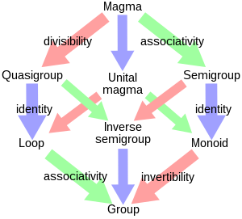

# Algebraic Structure

## 이항연산

집합 $S$가 존재할 때, **이항연산**은 다음과 같이 정의되는 함수 $\ast$를 말한다.

$$\ast : S\times S \rightarrow S$$

또는 이를 간단히 $\ast (a,b)=a\ast b$로 표현하기도 한다.

그리고 이항연산 $\ast$의 치역이 $S$의 부분집합일 때, $\ast$는 $S$에 대해 **닫혀있다**라고 한다.

이때, 이항연산이 정의된 집합을 **이항구조** 또는 **이항대수구조**라고 부르며, 식으로는 $\left<S,\ast\right>$으로 표현한다.

## 마그마

공집합이 아닌 집합 $S$와 $S$에서 정의된 이항연산 $\ast$으로 이루어진 이항구조 $\left<S,\ast \right>$가 있을 때, 이항연산 $\ast$가 $S$에 대해 닫혀있으면 $\left<S,\ast\right>$는 **마그마**라고 부른다.

마그마는 가장 기초가 되는 대수구조라고 할 수 있으며, 이후 다양한 규칙들이 추가되면서 새로운 대수구조들이 생겨난다.

## 단위 마그마

임의의 마그마 $\left<S,\ast\right>$가 있을 때, 임의의 원소 $a\in S$에 대해서 다음을 만족하는 원소 $e\in S$가 존재하면 $\left<S,\ast\right>$을 **단위마그마**라고 부른다.

$$e\ast a=a\ast e=a$$

이때, 원소 $e$를 항등원이라고 부르는데, 이는 곧 유일하다.

---
증명 : 

임의의 마그마 $\left<S,\ast\right>$가 있을 때, 임의의 원소 $a\in S$에 대하여 $e_L\ast a=a$를 만족하는 원소 $e_L\in S$를 좌항등원, $a\ast e_R=a$를 만족하는 원소 $e_R\in S$를 우항등원이라고 하자.

이때, 정의에 따라 $e_L = e_L\ast e_R = e_R$이 성립하므로 $e_L=e_R$이다.

또한 또 하나의 좌항등원 $e_L^{'}$가 존재하는 경우 마찬가지로 $e_L^{'}=e_R=e_L$이므로 항등원은 유일하다.

---

## 반군

임의의 마그마 $\left<S,\ast\right>$가 있을 때, 임의의 원소 $a,b,c\in S$에 대하여 다음이 성립하면 $\left<S,\ast\right>$를 반군이라고 부른다.

$$a\ast (b\ast c)=(a\ast b)\ast c$$

즉, 결합법칙이 성립하는 마그마를 반군이라고 부른다는 것이다.

## 유사군

임의의 마그마 $\left<S,\ast\right>$가 있을 때, 임의의 원소 $a,b\in S$에 대하여 다음을 만족하는 원소 $p,q$가 유일하면 $\left<S,\ast\right>$를 유사군이라고 부른다.

$$a\ast p=b \\ q\ast a=b$$

즉, 존재성과 유일성을 모두 만족하기 때문에, 나눗셈이 가능해진다. 

그리고 $b$에 항등원 $e$를 대입하면 $a\ast p=e$가 성립하므로 이는 곧 역원의 존재성과 유일성을 가지는 것과 동치이다.

## 고리, 역반군, 모노이드

이렇게 정의된 단위마그마, 반군, 유사군을 잘 조합하여 새로운 구조를 만들 수 있다.

유사군이며 단위마그마인 이항구조는 **고리**, 유사군이며 반군인 구조는 **역반군**, 단위마그마이며 반군인 구조는 **모노이드** 라고 부른다.

이들을 표로 정리하면 다음과 같이 나타낼 수 있다.

||결합법칙|항등원|역원|
|:---:|:---:|:---:|:---:|
|마그마|X|X|X|
||
|단위 마그마|X|O|X|
|반군|O|X|X|
|유사군|X|X|O|
||
|고리|X|O|O|
|역반군|O|X|O|
|모노이드|O|O|X|
||
|군|O|O|O|

그리고 이제 이들을 모두 만족하는 대수구조, 군을 만나볼 차례이다.